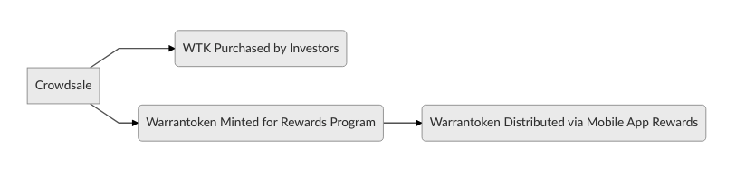

# Warrantoken Technical White Paper

## Contents

##### I. Abstract & Disclaimer
##### II. Warrantoken Smart Contract Protocol
##### III. Warrantoken Business API
##### IV. WTK Token Sale and WTK Token
##### V. Warrantoken Mobile App 
##### VI. Warrantoken Stand-Alone Blockchain

### Abstract & Disclaimer

UNIVEC FOUNDATION
February 8, 2018


Abstract: The Warrantoken protocol ("protocol") is a suite of software designed to automate and secure the product warranty process on the Ethereum Blockchain. The protocol, based on publicly and cryptographically verifiable proof of purchase and proof of ownership, allows manufacturers, brands, retailers and any other party to assign unique, one-time use randomly-generated private key to any products, services or digital goods sold, issued and traded online. Hashes of the unique private keys are stored on the Ethereum network and can be queried to Authenticate the user and prove ownership. Item data is stored, and is publicly available on, the Ethereum blockchain.

The protocol is the base layer of the Warrantoken ecosystem. It is used by brands to create warranties for their products, which can be represented with a QR code and included in any packaging, physical or digital. It is used by customers, including many first time users of digital tokens, who download the Mobile application and other clients to activate their product warranties.

A customer rewards and general purpose token, WTK, is an additional layer on the protocol which rewards users, introduces consumers to cryptographically secured digital assets, promotes the Warrantoken mobile app and protocol and allows for general purposes token transactions via the wallet on the main screen of the Warrantoken mobile app.

Copyright © 2018 Warrantoken

Without permission, anyone may use, reproduce or distribute any material in this white paper for non-commercial and educational use (i.e., other than for a fee or for commercial purposes) provided that the original source and the applicable copyright notice are cited.

DISCLAIMER: This Warrantoken Technical White Paper is for information purposes only. UNIVEC FOUNDATION does not guarantee the accuracy of or the conclusions reached in this white paper, and this white paper is provided “as is”. UNIVEC FOUNDATION does not make and expressly disclaims all representations and warranties, express, implied, statutory or otherwise, whatsoever, including, but not limited to: (i) warranties of merchantability, fitness for a particular purpose, suitability, usage, title or noninfringement; (ii) that the contents of this white paper are free from error; and (iii) that such contents will not infringe third-party rights. UNIVEC FOUNDATION and its affiliates shall have no liability for damages of any kind arising out of the use, reference to, or reliance on this white paper or any of the content contained herein, even if advised of the possibility of such damages. In no event will UNIVEC FOUNDATION or its affiliates be liable to any person or entity for any damages, losses, liabilities, costs or expenses of any kind, whether direct or indirect, consequential, compensatory, incidental, actual, exemplary, punitive or special for the use of, reference to, or reliance on this white paper or any of the content contained herein, including, without limitation, any loss of business, revenues, profits, data, use, goodwill or other intangible losses.


### Warrantoken Smart Contract Protocol

The Warrantoken smart contract protocol consists of functions for the creation, registration, and transfer of product information and warranties. 


Item information is stored on the blockchain in the Item structure, consisting of an identifier, owner, creator, activation indicator, and hashed password.

```
  struct Item {
    uint identifier;
    address owner;
    address creator;
    bool activated;
    bytes32 password;
  }
```

Businesses and entities working on behalf of businesses are able to create a warranty using the ```createWarranty``` function, supplying a KECCAK-256 hashed randomly generated, one-time-use password. The business then receives the unique identifier of the item. By including the identifier and the plaintext password in crafted QR bar code, the business will enable customers to use the Warrantoken mobile application to register the item with a simple QR code scan.

```
  function createWarranty(bytes32 password) public{
    uint myIdentifier = incrementIdentifier++;
    require(items[myIdentifier].identifier == 0 && password.length >10);
    items[myIdentifier] = Item({
      identifier: myIdentifier,
      owner: msg.sender,
      creator: msg.sender,
      password: password,
      activated: false
    });
    WarrantyCreated(myIdentifier, msg.sender);
  }

```

The original owner of the product may now register the Item using the Warrantoken mobile app. The Warrantoken mobile app extracts the identifier and plaintext password from the QR code. Passing this information to the ```registerWarranty``` function, the password is hashed and verified and the user is then able to set their address as the owner of the item. The item is indicated as having been activated.

```
  function registerWarranty(uint warrantyIdentifier, string password, address newOwner) public onlyOriginalOwner(warrantyIdentifier, password) {
    items[warrantyIdentifier].owner = newOwner;
    items[warrantyIdentifier].password = bytes32(0);
    items[warrantyIdentifier].activated = true;
    WarrantyTransferred(warrantyIdentifier, newOwner);
  }
```

The item owner may transfer the warranty to another person using the ```transferWarranty``` function and providing the other user's address.

```

  function transferWarranty(uint warrantyIdentifier, address newOwner) public onlyOwner(warrantyIdentifier, newOwner) {
    items[warrantyIdentifier].owner = newOwner;
    WarrantyTransferred(warrantyIdentifier, newOwner);
  }
  ```
  
  Other features of the protocol include events, authentication functions and modifiers, and a constructor function which sets the admin account - which allows the warrantoken mobile app to transfer items on a persons behalf, absorbing transactions fees. 
### Warrantoken Business API

The Warrantoken smart contract is intended to be accessed by the Warrantoken Business API. This allows metadata to be stored off-chain. The Warrantoken Business API is live and available online at https://api.warrantoken.com. The API allows businesses to register items with little blockchain knowledge and no programming or solidity knowledge. 

### WTK Token Sale and WTK Token

The WTK Token contract is powered by the best practices of and extensively tested with the truffle.js framework and OpenZeppelin library. The contract includes features of:

##### 50% of total supply designated as Rewards tokens and allocated to UNIVEC FOUNDATION.
##### Token sale ends January 1, 2019
##### No unfair bonus periods or presale
##### Tokens are fixed after conclusion of token sale and will be upgraded to Warrantoken "v2" stand-alone Blockchain (see below)




### Warrantoken Mobile App 

The Warrantoken mobile app functions as a client for the Warrantoken protocol and a wallet for WTK tokens, which may be given to customers as a reward. The Warrantoken mobile app is a client produced and controlled by UNIVEC FOUNDATION which uses direct connection via web3.js and private API's to enable these functions. The use of third party API's enables anonymity of current product owners, the storage of Warrantoken Protocol private information, and elimination of transaction fees. Please refer to the diagram below for a visual representation:


### Warrantoken Stand-Alone Blockchain

The warrantoken protocol will be upgraded from an Ethereum based platform to a stand-alone blockchain. This will reduce the need for extra gas to send WTK tokens, and will allow much less expensive registration of items for businesses. After the token sale is completed, on January 1 2019, WTK tokens on the ethreum blockchain will be migrated to the stand-alone platform.
